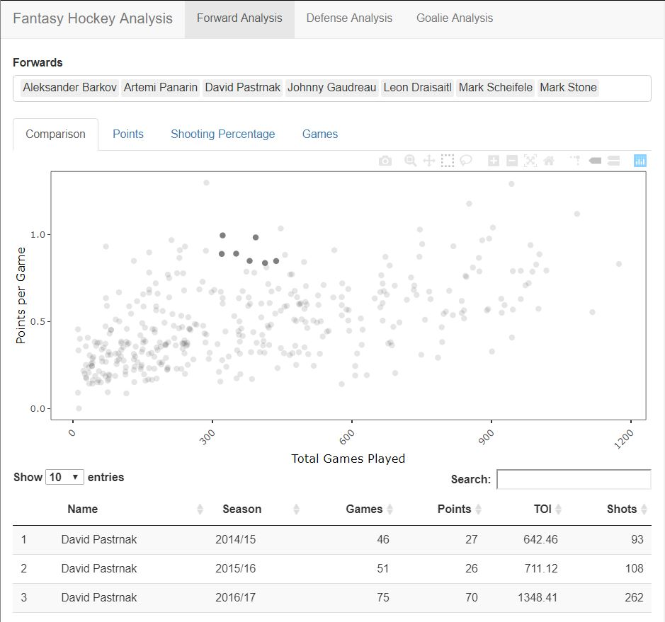
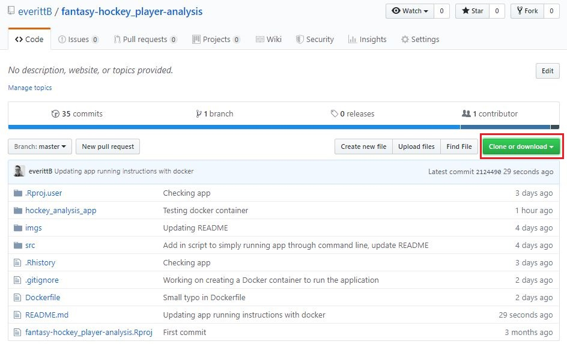

## Fantasy Hockey Player Analysis  

Creating an application that pulls NHL stats and creates an interactive visualization to analysis player statistics.

## Usage  

### Shiny Server  
The hosted Shiny Application can be found [here](https://everittb.shinyapps.io/hockey_analysis_app/).  

### Local Machine
- Clone this repository  

#### Pre-requisites  
**R version 3.5.0**  

| Packages | Version |
|:--------:|:-------:|  
| DT | 0.6 |
| plotly | 4.9.0 |
| lubridate | 1.7.4 |
| forcats | 0.4.0 |
| stringr | 1.4.0 |
| dplyr | 0.8.1 |
| purr | 0.3.2 |
| readr | 1.3.1 |
| tidyr | 0.8.3 |
| tibble | 2.1.1 |
| ggplot2 | 3.1.1 |
| tidyverse | 1.2.1 |
| shiny | 1.3.2 |  

**Python version 3.6.5**  

#### Setup Instructions    
1. Open a terminal window
2. Navigate to `fantasy-hockey_player-analysis/`
3. *Optionally - To update player season statistics run:* `python src/get_stats.py` *in the terminal window*  
4. Run ` Rscript src/launch_app.R` in the terminal window

#### Docker container  
1. Get the Docker Image by either:  
   1. Navigating to `fantasy-hockey_player-analysis/` and run `docker build -t fantasy-hocker_player-analysis .` in the terminal window  
   2. Run `docker pull everittb/fantasy-hockey_player-analysis`  
2. *Optionally - To update player season statistics:*  
   1.  *Run* `winpty docker run --rm -it -v "/c/Users/Brenden Everitt/Documents/fantasy-hockey_player-analysis/":/home/rstudio/fantasy-hockey_player-analysis/ fantasy-hockey_player-analysis //bin/bash` *in the terminal window*  
   2. *Run* `cd home/rstudio/fantasy-hockey_player-analysis/` in the terminal window  
   3. *Run* `python src/get_stats.py`
3. Run `winpty docker run --rm -p 3838:3838 -v <local_path>/fantasy-hockey_player-analysis:/srv/shiny-server/ fantasy-hockey_player-analysis` in the terminal window  
   - `<local_path>`: local file path to cloned repository
4. You can view R Shiny Application app can visiting: `http://localhost:3838/hockey_analysis_app/`  
5. To stop the R Shiny Application:  
   1. Run `docker images ps -a`  
   2. Run `docker stop <container_id>`  
      - `<container_id>`: CONTAINER ID of the running `fantasy-hocker_player-analysis` docker image
